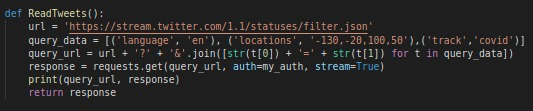
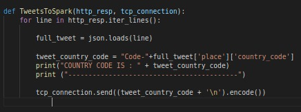
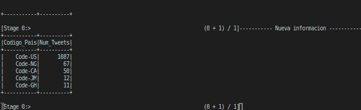
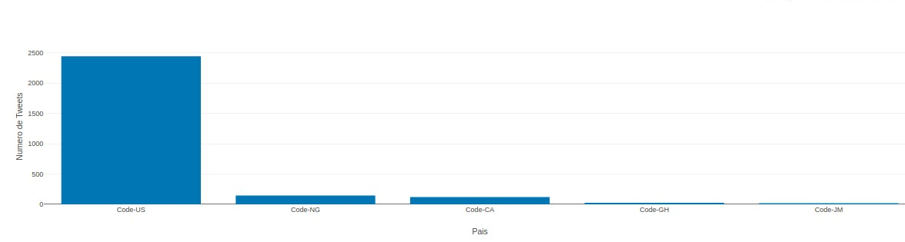

# Paises que más Tuitean sobre el Coronavirus


#### Alberto Martín Núñez

## Indice de contenidos

1. [Objetivo de la práctica](#id1)
2. [Aplicación PySpark](#id2)
    1. [Metodología y datos obtenidos](#id2.1)
    2. [Visualización de los datos](#id2.2)
3. [Conclusiones](#id4)


### Objetivo de la práctica <a name="id1"></a>

El objetivo de esta práctica consistía en plantear un problema a resolver utilizando **Spark Streaming**.

Como problema a resolver he propuesto conocer cuales son los paises que Tuitean más sobre el coronavirus. Tras la situación que estamos sufriendo en el planeta sobre las pandemia por el Covid-19, se plantea averiguar cuales son los países que actualmente estan *Tuiteando* más sobre esta tragedia. A través de esta información podríamos averiguar aspectos sobre esos países y la situación que estan viviendo, ya que la afluencia de hablar sobre el Covid-19 puede traer consigo información valiosa del estado de ese país.

### Aplicación PySpark <a name="id2"></a>

Ahora pasaré a detallar la aplicación PySpark que se ha realizado para afrontar el problema descrito anteriormente.

#### Metodología y datos obtenidos <a name="id2.1"></a>

Esta parte de la práctica se ha desarrollado en dos ficheros: *tweet_data.py* y *spark.py*

##### tweet_data.py

En este fichero consiste en recoger los tweets de Twitter para después enviarselo por una conexion tcp a nuestro *spark.py* que se encargará del procesamiento de los datos.

Esto lo hacemos de la siguiente forma:

- Obtención de Tweets
  


Creamos la *query* con la palabra clave *'covid'* y las credenciales que se obtienen al registrarse en **TwitterApps** para poder obtener los Tweets.

Estas credenciales estan en un fichero a parte que se llama *credentials* que no se ha incluido en el repositorio.

- Envío de Tweets a nuestro *sparkstreaming*
  


Aora cogemos la respuesta que nos da la funcion anterior y parseamos el *json* que nos devuelve y nos quedamos con el código del pais y estos los enviamos por una conexion TCP.

- Creación de la conexión
 
```python
TCP_IP = 'localhost'
TCP_PORT = 5556
conn = None
s = socket.socket(socket.AF_INET, socket.SOCK_STREAM)

s.bind((TCP_IP, TCP_PORT))
s.listen(1)

print("Esperando por la conexion")
conn, addr = s.accept()
print('------------------------')
print("Conectados, busquemos los paises que más hablan sobre el coronavirus")

resp = ReadTweets()
TweetsToSpark(resp, conn)

```

Realizamos una conexion a localhost en el puerto 5556 y llamamos a las funciones que se han creado cuando exista la conexión.

##### spark.py

En este fichero realizamos lo siguiente:

```python

# Configuracion de Spark
conf = SparkConf()
conf.setAppName("TwitterCovid")

# Creamos el contexto
sc = SparkContext(conf=conf)
sc.setLogLevel("ERROR")

# Creamos el streamingContext con un tiempo de 5 segundos
ssc = StreamingContext(sc, 5)


# Configuramos un "checkpoint" para permitir recuperar el RDD
ssc.checkpoint("../checkpoint_TwitterCovid")

# Leemos los datos desde localhost por el puerto 5556 que hemos configurado tambien en el fichero "tweet_data.py"
dataStream = ssc.socketTextStream("localhost",5556)
  
# Hacemos un Map para obtener ->  (codigo,1)
words_map = words.map(lambda x: (x, 1)) 

# LLamamos a la funcion updateStateByKey() para añadir los nuevos valores que vamos obteniendo
tags_totals = words_map.updateStateByKey(aggregate_tags_count)

# Procesamiento de los RDD en cada intervalo de tiempo
tags_totals.foreachRDD(process_rdd)

# Comenzamos el StreamingContext
ssc.start()
ssc.awaitTermination()
```

Una de las partes más interesante es el procesamiento de los datos que se realiza en cada intervalo de tiempo. En él creamos un contexto sql para guardar los datos en una tabla y luego acceder a ella para mostrarla.

1. Primeramente creamos el sql_context para nuestro **rdd** de nuestro StreamContext
   
   ```python
      def get_sql_context_instance(spark_context):
        if ('sqlContextSingletonInstance' not in globals()):
            globals()['sqlContextSingletonInstance'] = SQLContext(spark_context)
        return globals()['sqlContextSingletonInstance']

   sql_context = get_sql_context_instance(rdd.context)


    ```

2. Ahora transformamos nuestro **rdd** en un **row_rdd** para crear los campos en donde vamos a guardar los valores. Ahora podemos utilizar el contexto sql y el row_rdd para crear el dataframa y añadirlo a la tabla, la cual accederemos para obtener los datos.

```python

        row_rdd = rdd.map(lambda w: Row(word=w[0], word_count=w[1]))
        
        # creamos el dataframe
        country_df = sql_context.createDataFrame(row_rdd)
        
        # Una vez el dataframe creado creamos una tabla en un contexto sql con un nombre especifico
        sql_context.registerDataFrameAsTable(country_df, "countries")
      

```
3. Ahora podemos seleccionar de la tabla creada los datos que queremos con una consulta SQL:

```python

    # Seleccionamos los 5 paises con más tweets  
    country_counts_df = sql_context.sql("select word as Codigo_Pais, word_count as Num_Tweets from countries where word like 'Code-%'order by word_count desc limit 5")
    
    # Mostramos por la consola los datos de la consulta
    country_counts_df.show()
```



*Este sería un ejemplo de la salida en este paso*

```python    
    # Guardamos los datos de la consulta en un archivo
    country_counts_df.coalesce(1).write.format('com.databricks.spark.csv').mode('overwrite').option("header", "true").csv("/home/alberto/Documentos/Master_informatica/Computacion_en_la_nube/pyspark_twitter/data/country_file.csv")
   ```
    Como vemos se han guardado los archivos en un archivo *.csv* para poder manipularlos y crear una aplicación web de visualización.

#### Visualización de los datos <a name="id2.2"></a>

Para hacer la visualización se ha hecho un pequeño código en **Python** utilizando un framework llamado **Dash** diseñado para crear aplicaciones web. Es muy útil para crear cuadros de mando y aplicaciones de visualización.

Ejecutamos el archivo *appDash.py* para lanzar el servidor que nos sirve una página web en la dirección *localhost:8050*:


Como vemos en el anterior gif, vamos a la ruta *localhost:8050* y podemos arrastrar o seleccionar un archivo. El archivo que necesitamos esta en la carpeta *data*, lo seleccionamos y se nos muestran los datos que habiamos recogido. 

En la siguiente imagen vemos solamente el gráfico de barras con los datos y podemos observar como Estados Unidos es el país que mas *tuitea* con diferencia.




### Conclusiones <a name="id3"></a>

Como vemos en los resultados *Estados Unidos* es el país que mas Tuitea sobre **coronavirus** actualmente. Tenemos que tener en cuenta que depende del tiempo que tengamos la aplicación pyspark ejecutada. También influye que hay más cantidad de personas en Estados Unidos que en otros países y por eso hay una diferencia grande en los datos. Una solución podría ser separar Estados Unidos del resto de países o escoger un número mayor de países para mostrar.

Los otros países que más *tuitean* son *Nigeria, Canada, Ghana y Jamaica*. Estos resultados si parecen llamativos debido a la Geolocalizacion de los países. Esto puede resultar interesante para evaluar el estado del país y saber que esta ocurriendo.
